# Заметки по git


Сделать папку репозиторием
```
git init
```
«Разгитить» папку, если что-то пошло не так
```
rm -rf .git
```

Проверить состояние репозитория
```
git status
```
Подготовить файлы к сохранению
```
git add
```
Выполнить коммит
```
git commit -m 'text'
```
Просмотреть историю коммитов
```
git log
```

Создание ssh ключа
```
$ ssh-keygen -t ed25519 -C "электронная почта, к которой привязан ваш аккаунт на GitHub"
```

Привязать удалённый репозиторий к локальному
```
git remote add origin git@github.com:%ИМЯ_АККАУНТА%/first-project.git 
```
Убедиться, что репозитории связаны
```
git remote -v
```
Отправить изменения на удалённый репозиторий
```
git push
```
```
git push -u origin master
```
Получить сокращеннй лог
```
git log --oneline
```

# Что такое хеш. Хеширование коммитов


Хеширование (от англ. hash, «рубить», «крошить», «мешанина») — это способ преобразовать набор данных и получить их «отпечаток» (англ. fingerprint).
Информация о коммите — это набор данных: когда был сделан коммит, содержимое файлов в репозитории на момент коммита и ссылка на предыдущий, или родительский (англ. parent), коммит.
Git хеширует (преобразует) информацию о коммите с помощью алгоритма SHA-1 (от англ. Secure Hash Algorithm — «безопасный алгоритм хеширования») и получает для каждого коммита свой уникальный хеш — результат хеширования.

# Статусы untracked/tracked, staged и modified


Одна из ключевых задач Git — отслеживать изменения файлов в репозитории. Для этого каждый файл помечается каким-либо статусом. Рассмотрим основные.
untracked (англ. «неотслеживаемый»)


Мы говорили, что новые файлы в Git-репозитории помечаются как untracked, то есть неотслеживаемые. Git «видит», что такой файл существует, но не следит за изменениями в нём. У untracked-файла нет предыдущих версий, зафиксированных в коммитах или через команду git add.
staged (англ. «подготовленный»)
После выполнения команды git add файл попадает в staging area (от англ. stage — «сцена», «этап [процесса]» и area — «область»), то есть в список файлов, которые войдут в коммит. В этот момент файл находится в состоянии staged.

В одном из предыдущих уроков мы сравнили коммит с фотографией. Можно развить эту аналогию и сказать, что команда git add добавляет персонажей (текущее содержимое файла или нескольких файлов) на сцену (англ. stage) для общей фотографии, а git commit делает снимок всей сцены целиком. 
💡 Staging area, index и cache
Staging area также называют index (англ. «каталог») или cache (англ. «кеш»), а состояние файла staged иногда называют indexed или cached.

 
tracked (англ. «отслеживаемый»)

Состояние tracked — это противоположность untracked. Оно довольно широкое по смыслу: в него попадают файлы, которые уже были зафиксированы с помощью git commit, а также файлы, которые были добавлены в staging area командой git add. То есть все файлы, в которых Git так или иначе отслеживает изменения.
modified (англ. «изменённый»)

Состояние modified означает, что Git сравнил содержимое файла с последней сохранённой версией и нашёл отличия. Например, файл был закоммичен и после этого изменён.


